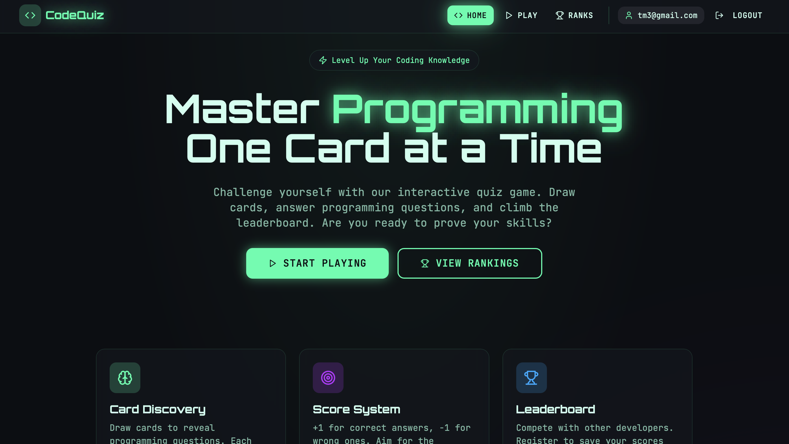
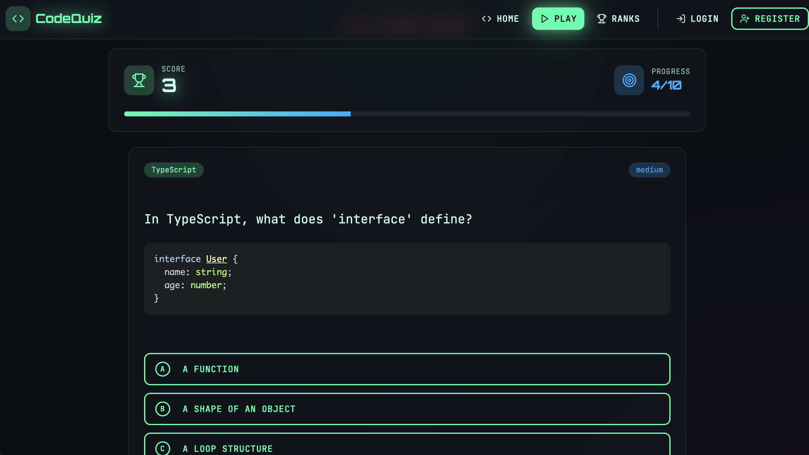

# Code Quest Arena
> **The Problem:** Developers often struggle to find engaging, interactive ways to test their knowledge and practice actual coding skills in a gamified environment. Traditional quizzes are static, and setting up local environments for small snippets is tedious.

> **Our Solution:** Code Quest Arena provides a seamless, browser-based playground where developers can challenge themselves with programming trivia and **execute real Python code** directly in the browser. It combines the fun of a card-based quiz game with the power of WebAssembly (WASM).

## AI System Development
This platform represents the future of software creation, built entirely through AI collaboration:
- **Frontend**: Designed and implemented with **Lovable**, delivering a premium, "lovable" user interface with modern aesthetics.
- **Backend**: Architected by **Antigravity** (powered by **Gemini 3 Pro**), ensuring robust API performance, secure authentication, and seamless containerization.


## Technologies and System Architecture
This project is built on a robust, modern stack designed for performance, scalability, and developer experience.

### System Architecture
The application follows a **Monolithic Containerized Architecture**:
- **Client**: A Single Page Application (SPA) built with React and Vite. It handles all user interactions and runs Python code locally via WebAssembly.
- **Server**: A FastAPI backend that provides RESTful endpoints for authentication, question retrieval, and score tracking.
- **Database**: SQLite (dev) / PostgreSQL (prod) managed via SQLAlchemy for persistent data storage.
- **Containerization**: The entire application (Front + Back) is packaged into a single Docker image using multi-stage builds for easy deployment.

### Technology Stack
- **Frontend**:
  - **Framework**: React 18, TypeScript, Vite.
  - **Styling**: Tailwind CSS, Lovable UI (AI-designed).
  - **Execution**: Pyodide (WASM) for client-side Python execution.
- **Backend**:
  - **Framework**: FastAPI (high-performance Python web framework).
  - **ORM**: SQLAlchemy.
  - **Auth**: PyJWT (Stateless JWT authentication).
- **DevOps**:
  - **Docker**: Multi-stage build (Node builder -> Python runtime).
  - **CI/CD**: Configured for Render and GitHub Actions.

## Front-end Implementation
The front-end is a responsive Single Page Application (SPA) built with **React**, **TypeScript**, and **Tailwind CSS**. It is fully functional, well-structured, and designed for an optimal user experience.

### Key Aspects
- **Component-Based Architecture**: Modular components (QuizCard, ScoreDisplay) for reusability.
- **State Management**: React hooks (`useState`, `useEffect`, Custom Hooks for Pyodide) manage application state.
- **Routing**: `react-router-dom` handles client-side navigation.
- **Testing**: Comprehensive tests covering core logic using **Vitest** and **React Testing Library**.

### Running Tests
To verify the front-end functionality, run the following commands:
```bash
cd frontend
npm install
npm test
```

### Visuals



## API Contract & OpenAPI Specification
The backend provides a fully documented **OpenAPI (Swagger)** specification that serves as the strict contract for frontend development, ensuring seamless integration.

### Accessing the Spec
When running locally or in Docker, the full interactive documentation is available at:
- **Swagger UI**: `http://localhost:8000/docs`
- **ReDoc**: `http://localhost:8000/redoc`
- **OpenAPI JSON**: `http://localhost:8000/openapi.json`

### Core Endpoints
The API fully reflects the frontend requirements:
- **Auth**: `POST /token` (Login), `POST /register` (Signup)
- **Game**: `GET /questions/` (Fetch quizzes with code snippets), `POST /score` (Submit results)
- **Leaderboard**: `GET /leaderboard` (Retrieve global rankings)

## Back-end Implementation
The backend is built with **FastAPI**, adhering strictly to the **OpenAPI** standards. It is modular, performant, and includes automated tests.

### Key Aspects
- **Modular Architecture**: Code is organized into `routers` (endpoints), `schemas` (Pydantic models), `models` (ORM), and `services` for separation of concerns.
- **Auto-Generated Documentation**: FastAPI automatically generates Swaggers/OpenAPI specs from the code, guaranteeing the implementation matches the documentation.
- **Type Safety**: Fully typed with Python type hints for robustness and editor support.

### Running Tests
The backend test suite covers authentication, database operations, and API endpoints. To run them:
```bash
cd backend
# storage is purely in-memory or temp file for tests
pytest
```

## Database Integration
The application uses **SQLAlchemy** as an ORM to provide a database-agnostic layer, ensuring smooth transitions between environments.

### Supported Databases
- **Development**: **SQLite** is used by default for zero-configuration local development. It is stored in `backend/sql_app.db`.
- **Production**: **PostgreSQL** is fully supported. The connection string can be easily switched via environment variables (e.g., `DATABASE_URL`).

### Data Management
- **Schema Management**: SQLAlchemy models (`models.py`) define the schema. Tables are automatically created on startup if they don't exist.
- **Seeding**: The `seed_data.py` script automatically populates the database with initial questions upon startup, making the setup instant.

## Containerization
The entire system is containerized using **Docker**, ensuring a consistent environment across development and production. The architecture bundles both the compiled React frontend and the Python backend into a single efficient image.

### Building and Running
A convenience script `rebuild.sh` is provided, but you can also run the standard Docker commands:

1.  **Build the Image**:
    ```bash
    docker build -t code-quest-arena .
    ```

2.  **Run the Container**:
    ```bash
    # Runs on port 8001
    docker run -d -p 8001:8000 code-quest-arena
    ```

3.  **Access the App**:
    Open `http://localhost:8001` in your browser.

## Integration Testing
Integration tests are **cleanly separated** in the `backend/tests/` directory. They verify the entire application flow, from API endpoints down to the database layer.

### Coverage
- **Workflow Testing**: Tests simulate real user actions (Register -> Login -> Fetch Questions -> Submit Score) ensure the system works as a whole.
- **Database Interactions**: All tests run against a test database instance to verify strict SQL constraints and data integrity without corrupting production data.
- **Key Modules**:
  - `test_api.py`: Covers authentication, token generation, and game flows.
  - `test_main.py`: Verifies app startup and health checks.

### Running Integration Tests
```bash
cd backend
pytest tests/
```

## Deployment
The project is configured for seamless deployment to cloud platforms like **Render** via Docker.

### Automated Deployment Steps
1.  **Configuration**: A `render.yaml` Blueprint file is included in the repository.
2.  **Platform Setup**:
    - Build a Docker image from the root definition.
    - Set the `PORT` environment variable (default 8000).
    - Map the health check endpoint to `/api/health`.
3.  **Launch**: Once connected to the GitHub repository, accidental changes triggers an automatic rebuild and redeploy.

> **Note**: While the deployment configuration is fully functional and tested, a live demo URL is not provided in this public documentation.

## CI/CD Pipeline
A robust **Continuous Integration and Continuous Deployment (CI/CD)** pipeline is implemented using **GitHub Actions**.

### Workflow
1.  **Automated Testing**: On every `push` or `pull request` to the `main` branch, the pipeline triggers:
    - **Backend Tests**: Sets up Python environment and runs `pytest`.
    - **Frontend Tests**: Sets up Node.js environment and runs `npm test`.
2.  **Conditional Deployment**: The application is **only** deployed to production (Render) if **all tests pass** successfully.
3.  **Deployment Trigger**: If tests pass on the `main` branch, a webhook triggers the Render build process defined in `render.yaml`.

## Running Locally with Docker
For the best local development experience that mirrors production, use Docker:

### Quick Start
```bash
# Use the convenience script
./rebuild.sh
```

This script will:
1. Stop any existing containers
2. Remove the old image to ensure a fresh build
3. Build a new Docker image with `--no-cache`
4. Start the container on port **8001**

### Manual Docker Commands
If you prefer to run Docker commands manually:

```bash
# Build the image
docker build -t code-quest-arena .

# Run the container
docker run -d -p 8001:8000 code-quest-arena

# View logs
docker logs -f $(docker ps -q --filter ancestor=code-quest-arena)

# Stop the container
docker stop $(docker ps -q --filter ancestor=code-quest-arena)
```

### Access the Application
Once running, open your browser to:
- **Application**: http://localhost:8001
- **API Docs**: http://localhost:8001/docs
- **Health Check**: http://localhost:8001/api/health

> **Note**: The application uses port **8001** externally (mapped to internal port 8000) to avoid conflicts with other local services.


## Key Functionality
- **Game Mechanics**: Flip cards to reveal questions. Answer correctly to gain points, incorrectly to lose them.
- **Live Code Execution**: A built-in Python editor powered by WASM allows users to run code and see output instantly, right inside the quiz card.
- **Dynamic Content**: Questions cover various topics (Python, JavaScript, CSS, etc.) and difficulty levels.
- **User Progression**: Users can create accounts to save their high scores and appear on the leaderboard.


## Features
- **Interactive Quizzes**: Multiple-choice questions with code snippets.
- **Client-Side Code Execution**: Run Python code directly in the browser using [Pyodide](https://pyodide.org/) (WASM).
- **Syntax Highlighting**: Beautiful code rendering with `react-syntax-highlighter`.
- **Authentication**: Secure JWT-based registration and login.
- **Leaderboard**: Real-time ranking of players.
- **Full Stack**: React (Vite) frontend + FastAPI backend.


## Getting Started

### Prerequisites
- Node.js (v18+)
- Python (v3.9+)
- Docker (optional)

### Local Development

1.  **Setup Backend**:
    ```bash
    cd backend
    python3 -m venv .venv
    source .venv/bin/activate  # or .venv\Scripts\activate on Windows
    pip install -r requirements.txt
    python seed_data.py        # Initialize database
    cd ..
    ```

2.  **Setup Frontend**:
    ```bash
    cd frontend
    npm install
    cd ..
    ```

3.  **Run Development Servers**:
    ```bash
    npm install  # Install root dependencies (concurrently)
    npm run dev
    ```
    Access the app at `http://localhost:8080` (Frontend) and `http://localhost:8000` (Backend API).

### Docker
Build and run the containerized application:
```bash
docker build -t code-quest-arena .
docker run -p 8000:8000 code-quest-arena
```
Access at `http://localhost:8000`.

## Deployment
This project is configured for one-click deployment on **Render**.
1. Push to GitHub.
2. Create a new Blueprint on Render.
3. Select this repository.
4. Render will use `render.yaml` to automatically deploy the Docker container.
